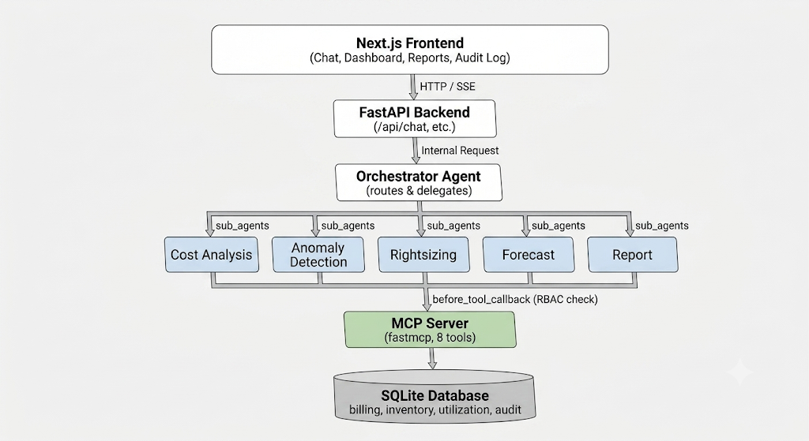

# CloudMind

**AI-Native FinOps Team Built on Google ADK**

Multi-agent AI system that analyzes, detects, optimizes, forecasts, and reports on cloud costs — with role-based security and full audit trails.


---

## Problem

Cloud cost management is broken. Organizations waste roughly 30% of their cloud spend on unoptimized resources, but fixing that requires FinOps expertise most teams don't have. Finance teams have no visibility into why costs move the way they do, and engineering teams stay reactive — finding out about a cost problem only after it shows up on an invoice.

## Solution

CloudMind is a multi-agent AI platform where five specialized agents — cost analysis, anomaly detection, rightsizing, forecasting, and reporting — collaborate under a root orchestrator to answer natural-language questions about cloud spend. Ask "why did our bill spike?" and get an answer tailored to who's asking: a CFO gets dollar impact and risk level, an engineer gets resource IDs and remediation commands.

## Architecture


## ADK Concepts Demonstrated

1. **Multi-agent orchestration** — root orchestrator delegating to 5 specialist agents via ADK's native `sub_agents` pattern
2. **Custom MCP server** — standalone `fastmcp` server exposing 8 tools for billing, utilization, inventory, and audit data
3. **Agent skills** — typed, reusable tool functions with `ToolContext` integration
4. **Callbacks & Guardrails** — `before_tool_callback` for RBAC enforcement, `after_tool_callback` for state updates and sanitization
5. **Security** — tool-level permission matrix enforced per agent, with audit logging of every action including denied attempts
6. **Shared state** — `ToolContext.state` for cross-agent memory, so findings from one agent are available to others without re-querying

## Tech Stack

| Layer | Technology |
|---|---|
| Agent framework | Google ADK |
| LLM | Gemini 2.5 Flash |
| Agent-tool protocol | MCP (via `fastmcp`) |
| Backend API | FastAPI |
| Frontend | Next.js |
| Database | SQLite |
| Charts | Recharts |

## Quick Start

```bash
# 1. Clone and set up
git clone <repo-url>
cd cloudmind

# 2. Add your API key
echo "GOOGLE_API_KEY=your_key_here" > .env

# 3. Set up backend
cd backend
python -m venv venv && .\venv\Scripts\activate
pip install -r requirements.txt
cd db && python seed.py && cd ..
python main.py  # Runs on port 8000

# 4. Set up frontend (new terminal)
cd frontend
npm install
npm run dev  # Runs on port 3000
```

Once both are running, open `http://localhost:3000` and start chatting with CloudMind.

## Demo

📺 [Watch the demo video](YOUTUBE_LINK_HERE)

## Project Structure

```
cloudmind/
├── backend/
│   ├── agents/
│   │   ├── orchestrator.py
│   │   ├── cost_analysis.py
│   │   ├── anomaly_detection.py
│   │   ├── rightsizing.py
│   │   ├── forecast.py
│   │   └── report.py
│   ├── mcp-server/
│   │   ├── server.py
│   │   └── tools/
│   │       └── billing.py
│   ├── routers/
│   │   └── chat.py
│   ├── db/
│   │   ├── seed.py
│   │   └── cloudmind.db
│   ├── callbacks.py
│   ├── main.py
│   └── requirements.txt
├── frontend/
│   ├── app/
│   ├── components/
│   └── package.json
├── .env
├── LICENSE
└── README.md
```

## License

This project is licensed under the MIT License — see the [LICENSE](LICENSE) file for details.
